# Adrian Suchorski (s5406272@bournemouth.ac.uk) Assignment Particle Explosions

## Overview
The goal of this project is to create a particle simulation in C++ using the NGL graphics library to generate various types of explosions. The particle simulation will be used to create visually stunning explosions that can be used in various applications such as games, special effects for film, and simulations. The UI implemented using QT

+ 
  
The project will involve creating a particle system that is capable of simulating the motion and behavior of individual particles. This will include simulating the effects of gravity, acceleration, initial speed and particle life. The particle system will be designed to be flexible, allowing for different types of explosions to be created by adjusting parameters such as the number of particles, their initial velocity, and the forces acting on them.

+ 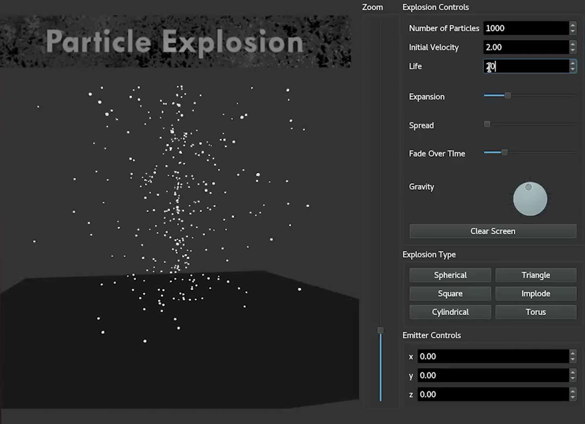
  
To visualize the explosion, the ngl graphics library will be used to create a 3D environment where the particles can be rendered. The project will be implemented in C++ using object-oriented programming principles to make the code reusable and easy to maintain. The code will be modular and well-documented to make it easy for other developers to extend or modify the particle simulation.

+ 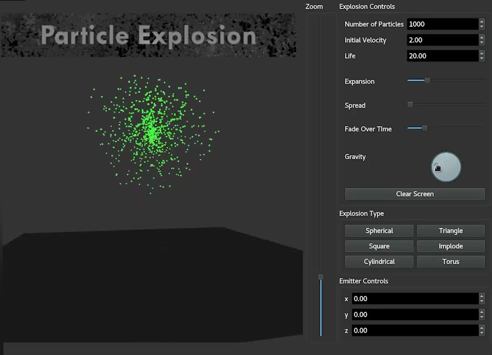

Overall, this project aims to create a flexible and realistic particle simulation that can generate different types of explosions using the ngl graphics library. The end result will be a powerful tool that can be used in various applications to create stunning visual effects.

+ 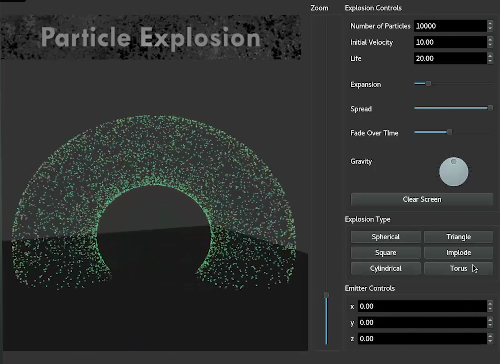
  
+ 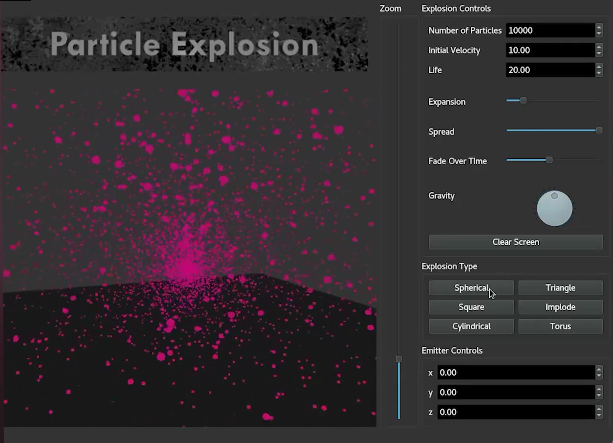
  
+ 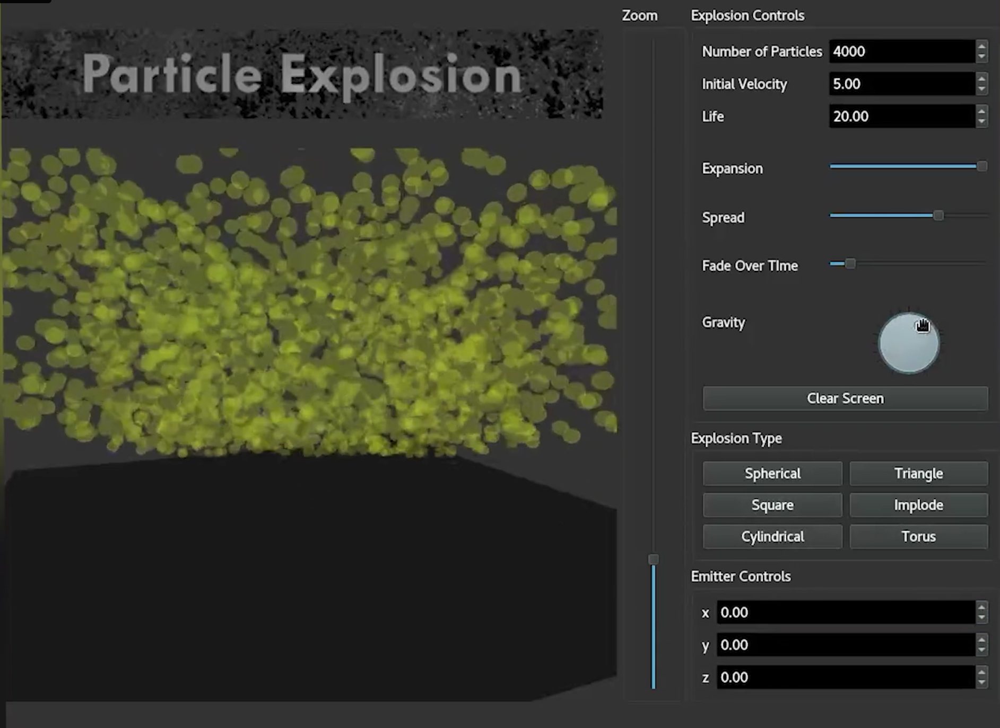

## Program Design

+ 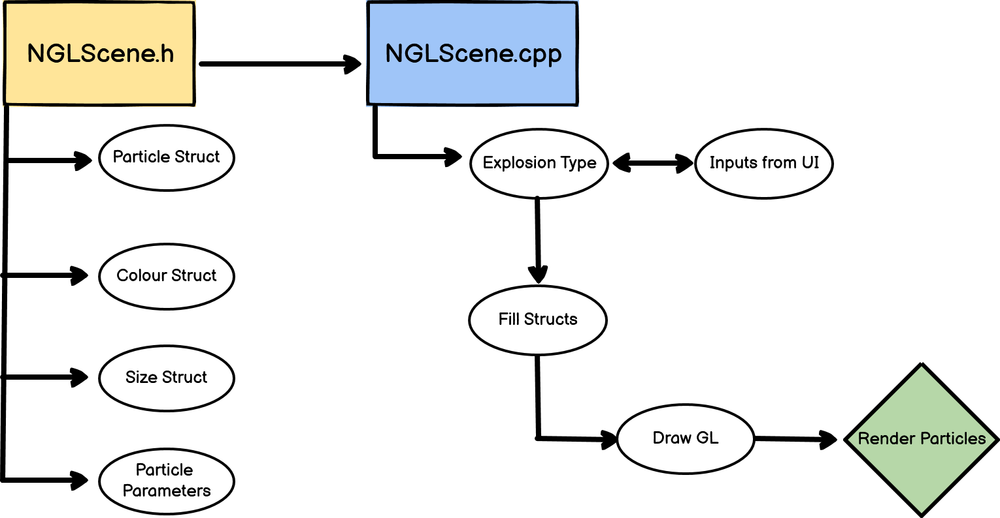
My class design and program flow will be centered around the NGLScene.cpp and the NGLScene class. NGLScene class will contain particle structs, colour structs, size structs and particle parameters such as initial velocity, gravity, spread and particle fade out over time. All those things will be employed in NGLScene.cpp, where using inputs from the user, different explosion types will be created. The particle and the other structs will then be filled with the provided or generatyed information and the particles will then be drawn on screen in the DrawGL function and then updated.

## Stage 1

The first step in developing my particle simulation was to set up NGL and create a blank NGL window. Having utilised the code from class, I created a blank NGL window with my NGLScene class and NGLScene.cpp file. I then have set up the camera and created a particle struct in the NGLScene class. I have then created a random particle function which emmits particles from the origin in random directions. I began looking into different types of explosions that my particles could take the shape of instead of just randomly scattering them around the screen without any rules. I have firstly considered using fractals. This would be implemented by launching a particle up initially, then allowing it to quickly multiply itself based on fractal equations such as Koch snowflake or Juilia set. For this I have looked at the following website for the fractal equations and began thinking how I could implement them in my code: http://taggedwiki.zubiaga.org/new_content/758614731a516fd636a9fddf829491fa .

## Stage 2

I began the second stage by adding more attributes and other affecting factors to my particles. I have given my particles initial velocity so that they get launched up upon running the code. I have then used vec3 to create a gravity vector and make the particles be affected by gravity. I then added life and collision with ground. The particles now launched up, then slowly began falling down until they hit the ground. The particles died if they reached their max age or hit the ground. The explosion then repeats if either the particles all died or all hit the ground. At this point I made the decision to research into 3D shapes such as the sphere, cylinder and torus instead of implemneting the fractal idea from earlier. By implementing the 3D equations for those shapes I could calculate the x,y,z values for the direction vector, essentially rendering the explosion to follow the shape of those shapes. For this I began looking at Spherical coordinates in order to generate a sphere shape: https://mathworld.wolfram.com/SphericalCoordinates.html
and shapes such as the torus: https://mathworld.wolfram.com/Torus.html and cylindrical coordinates: https://mathworld.wolfram.com/CylindricalCoordinates.html . 

## Stage 3

In this stage I have utilised spherical coordinates to create a spherical explosion, assigning the p.dir vector values to the spherical x,y,z coordinates. A sphere in 3D space can be defined using three quantities: a constant radius and two angles that describe the orientation of a point on the sphere relative to the origin. These angles are called the polar angle and the azimuthal angle. The equation of a sphere in spherical coordinates is simply r = const., where r is the distance from the origin to a point on the sphere. visualized in the diagram below:
+ 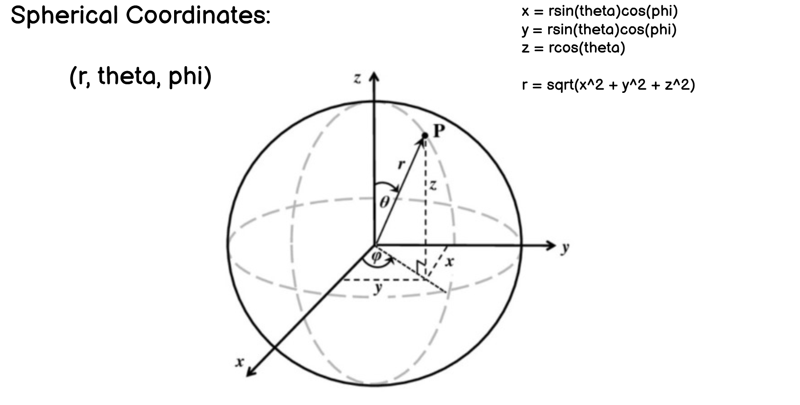

I have also utilised cylindrical coordinates to create a cylindrical explosion type. In cylindrical coordinates, a cylinder can be defined using two parameters: the radius (ρ) and the height (z). The equation of a cylinder in cylindrical coordinates can be written as:

ρ^2 = R^2

where R is the radius of the cylinder, and ρ is the distance from the z-axis to a point on the cylinder. The height of the cylinder can be defined by setting limits on the z-coordinate.
+ 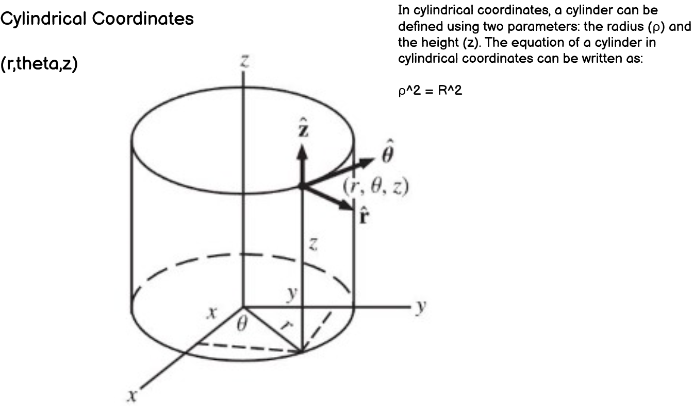

Another explosion type I utilised is a torus shape. The shape of the torus can be described using three parameters: the major radius, the minor radius, and two angles. I have written the torus equation in cartesian coordinates form:
+ 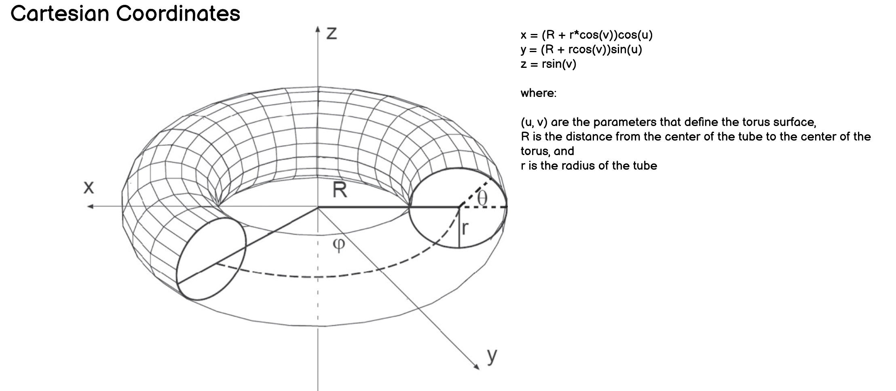

I have also assigned a random colour to the particles once they begin falling.

## Stage 4

In the fourth stage I have began creating a UI for my particle explosion simulation. For this I have used QT Creator. I first set up a blank QT screen and began designing my UI. I have created the following design of the UI in order to plan ahead:
+ 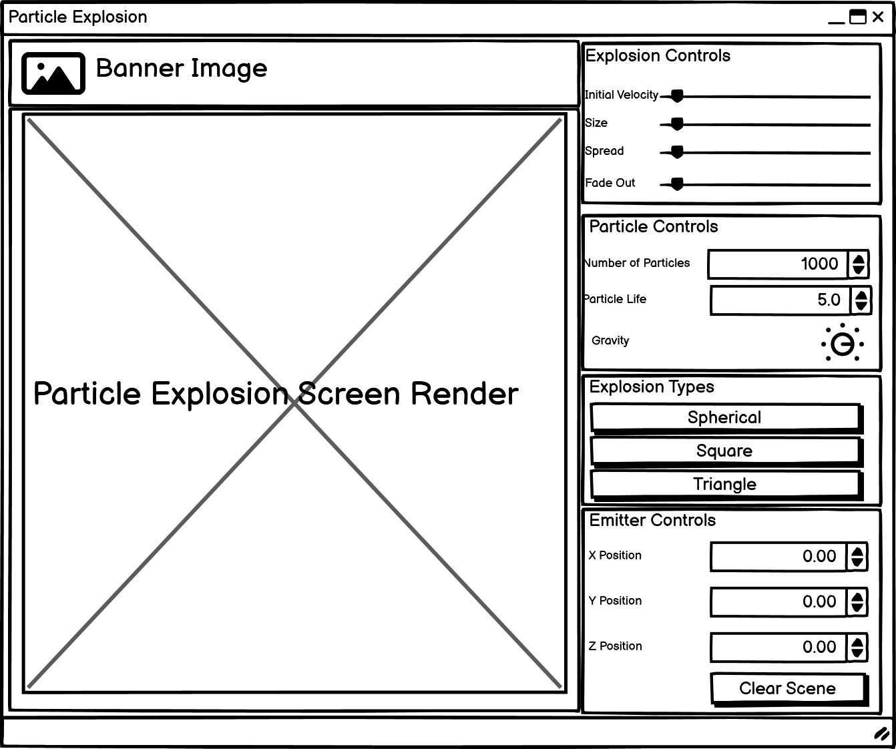
Using the design I created I have layed out my UI with buttons for particle controls, explosion types, emitter control and the NGL screen with my particle explosion. I have used slots and signals to link the buttons in the UI to the functions in my code. 

## Stage 5

In the final stage I have added more explosions by implementing sin, cos and tan wave functions, creating an effect of an imploding explosion. I have added various controls to each explosion controlling the explosion spread and particle fade out and linked them to the UI. I have added an image banner at the top of the UI and linked the final controls to functions in my NGLScene class. I have illustrated the overall flow of the program from when the user slects an explosion type with the following flowchart:
+ 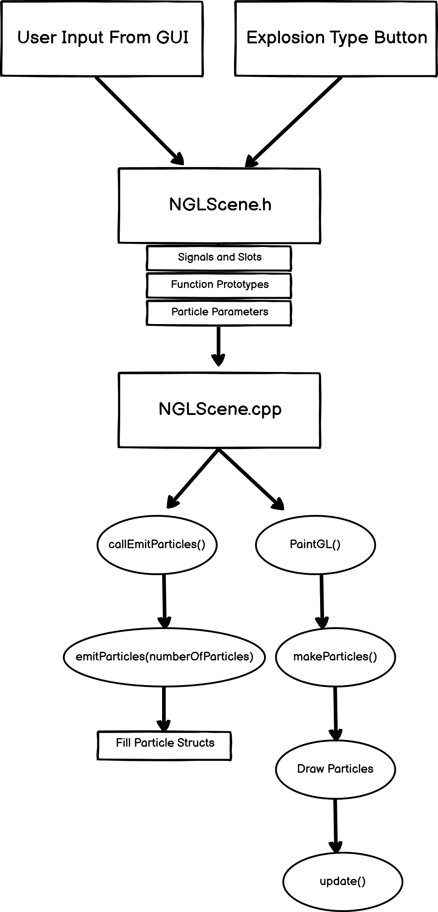

## Final Program Video

Link, if above doesn't work: https://vimeo.com/manage/videos/825994203

## References
BlankNGL: jmacey, 2022, avilable through:https://github.com/NCCA/BlankNGL
Spherical Coordinates Sphere Image: Gehan Anthonys, 2014, available through: https://www.researchgate.net/figure/Figure-A1-Spherical-coordinates_fig8_284609648
Cartiesian Coordinates Torus Image: 2018, availabe through: https://answers.unity.com/questions/1492313/dynamically-creating-a-torus-segment-in-unity-depe.html
Cylindrical Coordinates Cylinder Image: Weisstein, Eric W. "Cylindrical Coordinates." From MathWorld--A Wolfram Web Resource. https://mathworld.wolfram.com/CylindricalCoordinates.html 
